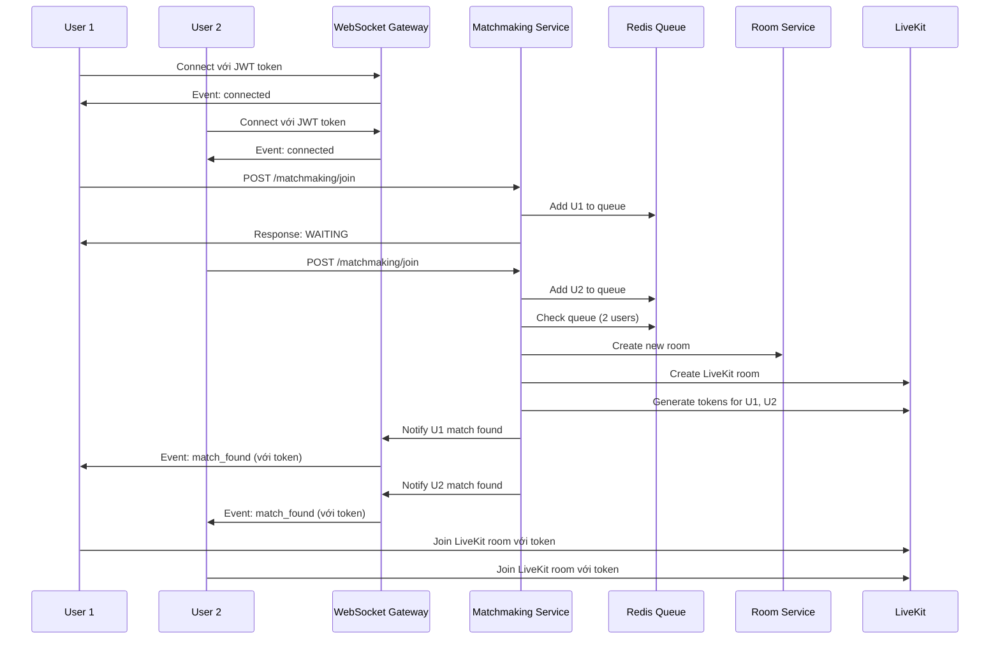
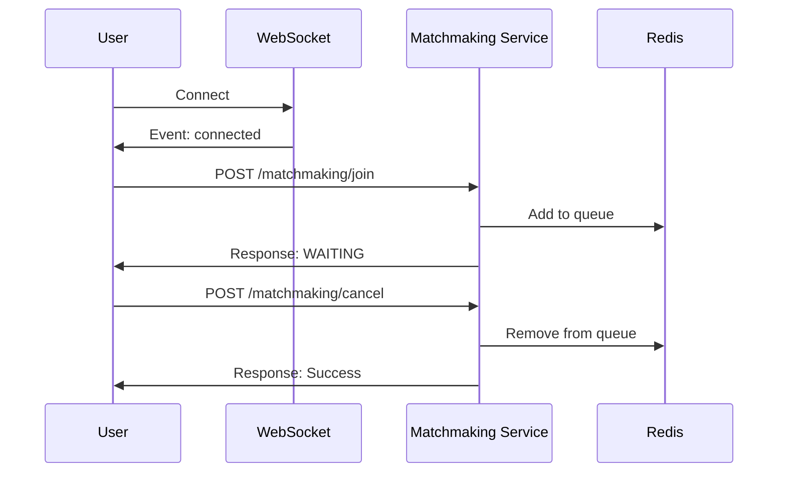
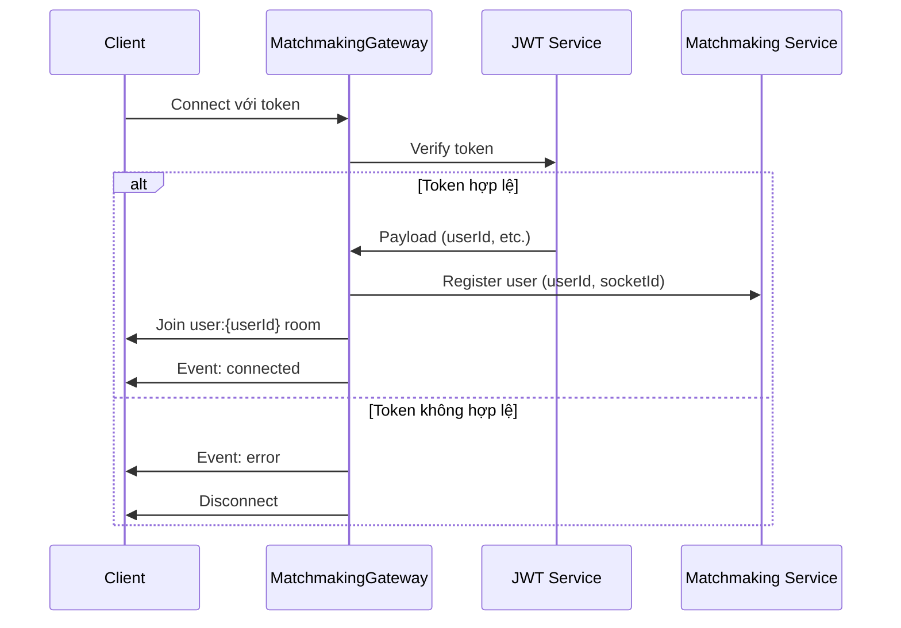

# Matchmaking Module - Hướng Dẫn Frontend Implementation

> **Phiên bản:** 1.0.0  
> **Ngày cập nhật:** 21/01/2026  
> **Module:** Matchmaking  
> **Backend Framework:** NestJS + Redis + Socket.IO + LiveKit

---

## 📋 Mục Lục

1. [Tổng Quan Module](#tổng-quan-module)
2. [Kiến Trúc Hệ Thống](#kiến-trúc-hệ-thống)
3. [API Endpoints](#api-endpoints)
4. [WebSocket Events](#websocket-events)
5. [Luồng Nghiệp Vụ](#luồng-nghiệp-vụ)
6. [Integration Guide](#integration-guide)
7. [Examples & Code Samples](#examples--code-samples)
8. [Error Handling](#error-handling)
9. [Best Practices](#best-practices)

---

## 🎯 Tổng Quan Module

Module **Matchmaking** quản lý hệ thống ghép đôi người dùng tự động (1-1 hoặc nhóm) để tạo phòng video call.

### Trạng Thái Người Dùng (UserState)

- **IDLE**: Không trong hàng đợi hoặc phòng
- **WAITING**: Đang chờ trong hàng đợi matchmaking
- **IN_ROOM**: Đã được ghép và đang trong phòng

### Tính Năng Chính

- ✅ Kết nối WebSocket với xác thực JWT
- ✅ Tham gia hàng đợi matchmaking (random)
- ✅ Hủy matchmaking khi đang chờ
- ✅ Tự động ghép người dùng khi đủ số lượng
- ✅ Tự động tạo phòng LiveKit và gửi token
- ✅ Thông báo real-time qua WebSocket
- ✅ Xem thống kê hệ thống matchmaking

---

## 🏗 Kiến Trúc Hệ Thống

### Công Nghệ Sử Dụng

- **Redis**: Lưu trữ hàng đợi và trạng thái người dùng
- **Socket.IO**: Real-time communication
- **JWT**: Authentication
- **LiveKit**: Video/audio room infrastructure

### Luồng Dữ Liệu

```
Client → WebSocket → MatchmakingGateway → MatchmakingService → Redis
                  ↓                                              ↓
              Socket.IO Events ← MatchmakingGateway ← Create Room
```

---

## 📡 API Endpoints

### Base URL

```
http://your-api-domain/matchmaking
```

### Authentication

Tất cả endpoints yêu cầu **Bearer Token** trong header:

```
Authorization: Bearer <your-jwt-token>
```

---

### 1. Join Matchmaking (Tham Gia Hàng Đợi)

#### Endpoint

```http
POST /matchmaking/join
```

#### Description

Tham gia hàng đợi matchmaking ngẫu nhiên. Nếu có phòng sẵn sàng, người dùng được ghép ngay lập tức. Nếu không, người dùng sẽ chờ trong hàng đợi.

#### Prerequisites

- ⚠️ **Bắt buộc**: Người dùng phải kết nối WebSocket trước khi gọi API này

#### Request Headers

```http
Authorization: Bearer <jwt-token>
Content-Type: application/json
```

#### Request Body

```json
{}
```

> **Note**: Không cần body parameters cho random matching

#### Response (Success - Matched)

```json
{
  "status": "MATCHED",
  "message": "Joined room successfully!",
  "matchData": {
    "roomId": "550e8400-e29b-41d4-a716-446655440000",
    "livekitRoomName": "room_1234567890",
    "token": "eyJhbGciOiJIUzI1NiIsInR5cCI6IkpXVCJ9..."
  }
}
```

#### Response (Success - Waiting)

```json
{
  "status": "WAITING",
  "message": "Waiting for more users..."
}
```

#### Status Codes

- **200**: Thành công (matched hoặc waiting)
- **401**: Unauthorized (không có token hoặc token không hợp lệ)
- **409**: Conflict (người dùng đã trong phòng/hàng đợi, hoặc chưa kết nối WebSocket)

#### Error Response Examples

**Chưa kết nối WebSocket:**

```json
{
  "statusCode": 409,
  "message": "Please connect to WebSocket before joining matchmaking",
  "error": "Conflict"
}
```

**Đã trong hàng đợi:**

```json
{
  "statusCode": 409,
  "message": "User already in matchmaking queue",
  "error": "Conflict"
}
```

---

### 2. Cancel Matchmaking (Hủy Hàng Đợi)

#### Endpoint

```http
POST /matchmaking/cancel
```

#### Description

Rời khỏi hàng đợi matchmaking nếu đang chờ.

#### Request Headers

```http
Authorization: Bearer <jwt-token>
Content-Type: application/json
```

#### Request Body

```json
{}
```

#### Response (Success)

```json
{
  "message": "You have been removed from matchmaking queue"
}
```

#### Status Codes

- **200**: Thành công
- **401**: Unauthorized
- **409**: User không trong hàng đợi

#### Error Response Example

```json
{
  "statusCode": 409,
  "message": "User is not in matchmaking queue",
  "error": "Conflict"
}
```

---

### 3. Get Matchmaking Stats (Thống Kê)

#### Endpoint

```http
GET /matchmaking/stats
```

#### Description

Lấy thống kê hệ thống matchmaking (dành cho debugging/monitoring).

#### Request Headers

```http
Authorization: Bearer <jwt-token>
```

#### Response (Success)

```json
{
  "usersInQueue": 5,
  "activeRooms": 12,
  "totalUsers": 29,
  "queueDetails": {
    "waiting": 5,
    "inRoom": 24
  }
}
```

#### Status Codes

- **200**: Thành công
- **401**: Unauthorized

---

## 🔌 WebSocket Events

### Connection Setup

#### Namespace

```
/matchmaking
```

#### Connection URL

```javascript
const socket = io('http://your-api-domain/matchmaking', {
  auth: {
    token: 'your-jwt-token',
  },
});
```

---

### Events From Server (Listen)

#### 1. `connected`

Xác nhận kết nối thành công.

**Payload:**

```json
{
  "userId": "user-uuid-123",
  "message": "Successfully connected to matchmaking server"
}
```

**Example:**

```javascript
socket.on('connected', (data) => {
  console.log('Connected:', data.userId);
});
```

---

#### 2. `match_found`

Thông báo đã tìm thấy match (đối thủ).

**Payload:**

```json
{
  "roomId": "room-uuid-456",
  "opponentId": "opponent-user-id",
  "opponentName": "John Doe",
  "livekitToken": "eyJhbGciOiJIUzI1NiIsInR5cCI6IkpXVCJ9...",
  "livekitUrl": "ws://localhost:7880"
}
```

**Example:**

```javascript
socket.on('match_found', (data) => {
  console.log('Match found!', data);
  // Redirect to room with LiveKit token
  joinLivekitRoom(data.roomId, data.livekitToken);
});
```

---

#### 3. `error`

Thông báo lỗi từ server.

**Payload:**

```json
{
  "message": "Error description"
}
```

**Example:**

```javascript
socket.on('error', (error) => {
  console.error('Error:', error.message);
  showErrorToUser(error.message);
});
```

---

#### 4. `room_joined`

Xác nhận đã tham gia Socket.IO room thành công.

**Payload:**

```json
{
  "roomId": "room-uuid-123",
  "message": "Successfully joined room"
}
```

---

#### 5. `player_joined`

Thông báo có người chơi khác tham gia room.

**Payload:**

```json
{
  "userId": "other-user-id",
  "roomId": "room-uuid-123"
}
```

---

#### 6. `info`

Thông tin hệ thống.

**Payload:**

```json
{
  "message": "Information message"
}
```

---

### Events To Server (Emit)

#### 1. `join_room`

Tham gia Socket.IO room cụ thể (sau khi có roomId).

**Payload:**

```json
{
  "roomId": "room-uuid-123"
}
```

**Response:**

```json
{
  "success": true,
  "roomId": "room-uuid-123"
}
```

**Example:**

```javascript
socket.emit('join_room', { roomId: 'room-uuid-123' }, (response) => {
  console.log('Joined room:', response);
});
```

---

#### 2. `leave_room`

⚠️ **Deprecated**: Nên sử dụng REST API thay vì event này.

**Server Response:**

```json
{
  "success": false,
  "message": "Use REST API endpoint"
}
```

---

## 🔄 Luồng Nghiệp Vụ

### 1. Luồng Matchmaking Thành Công



---

### 2. Luồng Hủy Matchmaking



---

### 3. Luồng Kết Nối WebSocket



---

## 🚀 Integration Guide

### Step 1: Setup Socket.IO Client

#### Installation

```bash
npm install socket.io-client
# or
yarn add socket.io-client
```

#### Initialize Connection

```typescript
import { io, Socket } from 'socket.io-client';

const MATCHMAKING_URL = process.env.NEXT_PUBLIC_API_URL + '/matchmaking';

let socket: Socket | null = null;

export const connectMatchmaking = (token: string): Socket => {
  if (socket?.connected) {
    return socket;
  }

  socket = io(MATCHMAKING_URL, {
    auth: {
      token: token, // JWT token
    },
    transports: ['websocket', 'polling'],
    reconnection: true,
    reconnectionDelay: 1000,
    reconnectionAttempts: 5,
  });

  return socket;
};

export const disconnectMatchmaking = () => {
  if (socket) {
    socket.disconnect();
    socket = null;
  }
};

export const getMatchmakingSocket = (): Socket | null => {
  return socket;
};
```

---

### Step 2: Setup Event Listeners

```typescript
export const setupMatchmakingListeners = (
  socket: Socket,
  callbacks: {
    onConnected?: (data: any) => void;
    onMatchFound?: (data: any) => void;
    onError?: (error: any) => void;
    onRoomJoined?: (data: any) => void;
    onPlayerJoined?: (data: any) => void;
  },
) => {
  // Connection confirmed
  socket.on('connected', (data) => {
    console.log('[Matchmaking] Connected:', data);
    callbacks.onConnected?.(data);
  });

  // Match found!
  socket.on('match_found', (data) => {
    console.log('[Matchmaking] Match found:', data);
    callbacks.onMatchFound?.(data);
  });

  // Error occurred
  socket.on('error', (error) => {
    console.error('[Matchmaking] Error:', error);
    callbacks.onError?.(error);
  });

  // Room joined
  socket.on('room_joined', (data) => {
    console.log('[Matchmaking] Room joined:', data);
    callbacks.onRoomJoined?.(data);
  });

  // Player joined
  socket.on('player_joined', (data) => {
    console.log('[Matchmaking] Player joined:', data);
    callbacks.onPlayerJoined?.(data);
  });

  // Socket.IO connection errors
  socket.on('connect_error', (error) => {
    console.error('[Matchmaking] Connection error:', error);
    callbacks.onError?.(error);
  });

  socket.on('disconnect', (reason) => {
    console.log('[Matchmaking] Disconnected:', reason);
  });
};
```

---

### Step 3: API Service Functions

```typescript
import axios from 'axios';

const API_BASE_URL = process.env.NEXT_PUBLIC_API_URL;

interface MatchmakingResponse {
  status: 'MATCHED' | 'WAITING';
  message: string;
  matchData?: {
    roomId: string;
    livekitRoomName: string;
    token: string;
  };
}

export const joinMatchmaking = async (token: string): Promise<MatchmakingResponse> => {
  const response = await axios.post(
    `${API_BASE_URL}/matchmaking/join`,
    {},
    {
      headers: {
        Authorization: `Bearer ${token}`,
      },
    },
  );
  return response.data;
};

export const cancelMatchmaking = async (token: string): Promise<void> => {
  await axios.post(
    `${API_BASE_URL}/matchmaking/cancel`,
    {},
    {
      headers: {
        Authorization: `Bearer ${token}`,
      },
    },
  );
};

export const getMatchmakingStats = async (token: string) => {
  const response = await axios.get(`${API_BASE_URL}/matchmaking/stats`, {
    headers: {
      Authorization: `Bearer ${token}`,
    },
  });
  return response.data;
};
```

---

## 💻 Examples & Code Samples

### Example 1: React Component - Matchmaking Flow

```tsx
import React, { useState, useEffect } from 'react';
import { useAuth } from '@/hooks/useAuth'; // Your auth hook
import {
  connectMatchmaking,
  disconnectMatchmaking,
  getMatchmakingSocket,
  setupMatchmakingListeners,
} from '@/services/matchmaking-socket';
import { joinMatchmaking, cancelMatchmaking } from '@/services/matchmaking-api';
import { useRouter } from 'next/router';

type MatchmakingStatus = 'IDLE' | 'CONNECTING' | 'WAITING' | 'MATCHED';

export const MatchmakingComponent: React.FC = () => {
  const router = useRouter();
  const { token } = useAuth();

  const [status, setStatus] = useState<MatchmakingStatus>('IDLE');
  const [error, setError] = useState<string | null>(null);
  const [matchData, setMatchData] = useState<any>(null);

  useEffect(() => {
    if (!token) return;

    // Connect to WebSocket
    const socket = connectMatchmaking(token);

    // Setup listeners
    setupMatchmakingListeners(socket, {
      onConnected: (data) => {
        console.log('WebSocket connected:', data.userId);
        setStatus('IDLE');
      },
      onMatchFound: (data) => {
        console.log('Match found!', data);
        setStatus('MATCHED');
        setMatchData(data);

        // Redirect to room after short delay
        setTimeout(() => {
          router.push(`/room/${data.roomId}?token=${data.livekitToken}`);
        }, 1500);
      },
      onError: (error) => {
        setError(error.message || 'An error occurred');
        setStatus('IDLE');
      },
    });

    // Cleanup on unmount
    return () => {
      disconnectMatchmaking();
    };
  }, [token, router]);

  const handleJoinMatchmaking = async () => {
    try {
      setError(null);
      setStatus('CONNECTING');

      const socket = getMatchmakingSocket();
      if (!socket?.connected) {
        throw new Error('Please wait for WebSocket connection');
      }

      const response = await joinMatchmaking(token!);

      if (response.status === 'MATCHED') {
        setStatus('MATCHED');
        setMatchData(response.matchData);
        // Redirect immediately
        router.push(`/room/${response.matchData!.roomId}?token=${response.matchData!.token}`);
      } else {
        setStatus('WAITING');
      }
    } catch (err: any) {
      setError(err.response?.data?.message || err.message);
      setStatus('IDLE');
    }
  };

  const handleCancelMatchmaking = async () => {
    try {
      await cancelMatchmaking(token!);
      setStatus('IDLE');
      setError(null);
    } catch (err: any) {
      setError(err.response?.data?.message || err.message);
    }
  };

  return (
    <div className="matchmaking-container">
      <h1>Matchmaking</h1>

      {error && <div className="error-message">{error}</div>}

      {status === 'IDLE' && <button onClick={handleJoinMatchmaking}>Find Match</button>}

      {status === 'CONNECTING' && <div className="loading">Connecting...</div>}

      {status === 'WAITING' && (
        <div className="waiting">
          <div className="spinner">⏳</div>
          <p>Searching for opponent...</p>
          <button onClick={handleCancelMatchmaking}>Cancel</button>
        </div>
      )}

      {status === 'MATCHED' && matchData && (
        <div className="matched">
          <h2>Match Found! 🎉</h2>
          <p>Opponent: {matchData.opponentName || 'Anonymous'}</p>
          <p>Redirecting to room...</p>
        </div>
      )}
    </div>
  );
};
```

---

### Example 2: Vue 3 Composition API

```vue
<template>
  <div class="matchmaking-container">
    <h1>Matchmaking</h1>

    <div v-if="error" class="error-message">
      {{ error }}
    </div>

    <button v-if="status === 'IDLE'" @click="handleJoinMatchmaking">Find Match</button>

    <div v-if="status === 'CONNECTING'" class="loading">Connecting...</div>

    <div v-if="status === 'WAITING'" class="waiting">
      <div class="spinner">⏳</div>
      <p>Searching for opponent...</p>
      <button @click="handleCancelMatchmaking">Cancel</button>
    </div>

    <div v-if="status === 'MATCHED' && matchData" class="matched">
      <h2>Match Found! 🎉</h2>
      <p>Opponent: {{ matchData.opponentName || 'Anonymous' }}</p>
      <p>Redirecting to room...</p>
    </div>
  </div>
</template>

<script setup lang="ts">
import { ref, onMounted, onUnmounted } from 'vue';
import { useRouter } from 'vue-router';
import { useAuthStore } from '@/stores/auth';
import {
  connectMatchmaking,
  disconnectMatchmaking,
  getMatchmakingSocket,
  setupMatchmakingListeners,
} from '@/services/matchmaking-socket';
import { joinMatchmaking, cancelMatchmaking } from '@/services/matchmaking-api';

type MatchmakingStatus = 'IDLE' | 'CONNECTING' | 'WAITING' | 'MATCHED';

const router = useRouter();
const authStore = useAuthStore();

const status = ref<MatchmakingStatus>('IDLE');
const error = ref<string | null>(null);
const matchData = ref<any>(null);

onMounted(() => {
  const token = authStore.token;
  if (!token) return;

  // Connect WebSocket
  const socket = connectMatchmaking(token);

  // Setup listeners
  setupMatchmakingListeners(socket, {
    onConnected: (data) => {
      console.log('WebSocket connected:', data.userId);
      status.value = 'IDLE';
    },
    onMatchFound: (data) => {
      console.log('Match found!', data);
      status.value = 'MATCHED';
      matchData.value = data;

      // Redirect after delay
      setTimeout(() => {
        router.push({
          name: 'room',
          params: { id: data.roomId },
          query: { token: data.livekitToken },
        });
      }, 1500);
    },
    onError: (err) => {
      error.value = err.message || 'An error occurred';
      status.value = 'IDLE';
    },
  });
});

onUnmounted(() => {
  disconnectMatchmaking();
});

const handleJoinMatchmaking = async () => {
  try {
    error.value = null;
    status.value = 'CONNECTING';

    const socket = getMatchmakingSocket();
    if (!socket?.connected) {
      throw new Error('Please wait for WebSocket connection');
    }

    const response = await joinMatchmaking(authStore.token!);

    if (response.status === 'MATCHED') {
      status.value = 'MATCHED';
      matchData.value = response.matchData;
      router.push({
        name: 'room',
        params: { id: response.matchData!.roomId },
        query: { token: response.matchData!.token },
      });
    } else {
      status.value = 'WAITING';
    }
  } catch (err: any) {
    error.value = err.response?.data?.message || err.message;
    status.value = 'IDLE';
  }
};

const handleCancelMatchmaking = async () => {
  try {
    await cancelMatchmaking(authStore.token!);
    status.value = 'IDLE';
    error.value = null;
  } catch (err: any) {
    error.value = err.response?.data?.message || err.message;
  }
};
</script>

<style scoped>
.matchmaking-container {
  max-width: 600px;
  margin: 0 auto;
  padding: 2rem;
  text-align: center;
}

.error-message {
  background: #fee;
  color: #c33;
  padding: 1rem;
  border-radius: 8px;
  margin-bottom: 1rem;
}

.waiting,
.matched {
  padding: 2rem;
  border: 2px solid #ddd;
  border-radius: 12px;
  margin-top: 1rem;
}

.spinner {
  font-size: 3rem;
  animation: spin 2s linear infinite;
}

@keyframes spin {
  from {
    transform: rotate(0deg);
  }
  to {
    transform: rotate(360deg);
  }
}
</style>
```

---

### Example 3: Plain JavaScript (Vanilla)

```javascript
// matchmaking.js

let socket = null;
let currentStatus = 'IDLE';
let token = null; // Get from your auth system

// Initialize
function initMatchmaking(authToken) {
  token = authToken;

  // Connect WebSocket
  socket = io('http://your-api-domain/matchmaking', {
    auth: { token: authToken },
    transports: ['websocket', 'polling'],
  });

  // Setup listeners
  socket.on('connected', (data) => {
    console.log('Connected:', data);
    updateUI('IDLE');
  });

  socket.on('match_found', (data) => {
    console.log('Match found!', data);
    updateUI('MATCHED', data);

    // Redirect to room
    setTimeout(() => {
      window.location.href = `/room.html?roomId=${data.roomId}&token=${data.livekitToken}`;
    }, 2000);
  });

  socket.on('error', (error) => {
    console.error('Error:', error);
    showError(error.message);
    updateUI('IDLE');
  });
}

// Join matchmaking
async function joinMatchmaking() {
  try {
    updateUI('CONNECTING');

    if (!socket?.connected) {
      throw new Error('WebSocket not connected');
    }

    const response = await fetch('http://your-api-domain/matchmaking/join', {
      method: 'POST',
      headers: {
        Authorization: `Bearer ${token}`,
        'Content-Type': 'application/json',
      },
      body: JSON.stringify({}),
    });

    if (!response.ok) {
      const error = await response.json();
      throw new Error(error.message);
    }

    const data = await response.json();

    if (data.status === 'MATCHED') {
      updateUI('MATCHED', data.matchData);
      window.location.href = `/room.html?roomId=${data.matchData.roomId}&token=${data.matchData.token}`;
    } else {
      updateUI('WAITING');
    }
  } catch (error) {
    showError(error.message);
    updateUI('IDLE');
  }
}

// Cancel matchmaking
async function cancelMatchmaking() {
  try {
    await fetch('http://your-api-domain/matchmaking/cancel', {
      method: 'POST',
      headers: {
        Authorization: `Bearer ${token}`,
        'Content-Type': 'application/json',
      },
      body: JSON.stringify({}),
    });

    updateUI('IDLE');
  } catch (error) {
    showError(error.message);
  }
}

// UI Update functions
function updateUI(status, data = null) {
  currentStatus = status;

  const container = document.getElementById('matchmaking-container');

  switch (status) {
    case 'IDLE':
      container.innerHTML = `
        <h1>Matchmaking</h1>
        <button onclick="joinMatchmaking()">Find Match</button>
      `;
      break;

    case 'CONNECTING':
      container.innerHTML = `
        <h1>Matchmaking</h1>
        <p>Connecting...</p>
      `;
      break;

    case 'WAITING':
      container.innerHTML = `
        <h1>Matchmaking</h1>
        <div class="spinner">⏳</div>
        <p>Searching for opponent...</p>
        <button onclick="cancelMatchmaking()">Cancel</button>
      `;
      break;

    case 'MATCHED':
      container.innerHTML = `
        <h1>Match Found! 🎉</h1>
        <p>Opponent: ${data?.opponentName || 'Anonymous'}</p>
        <p>Redirecting to room...</p>
      `;
      break;
  }
}

function showError(message) {
  const errorDiv = document.createElement('div');
  errorDiv.className = 'error-message';
  errorDiv.textContent = message;

  const container = document.getElementById('matchmaking-container');
  container.insertBefore(errorDiv, container.firstChild);

  setTimeout(() => errorDiv.remove(), 5000);
}

// Cleanup on page unload
window.addEventListener('beforeunload', () => {
  if (socket) {
    socket.disconnect();
  }
});
```

---

## ❌ Error Handling

### Common Errors

#### 1. WebSocket Connection Errors

**Error**: `Authentication required`

```json
{
  "message": "Authentication required"
}
```

**Cause**: Không gửi token hoặc token không hợp lệ  
**Solution**: Đảm bảo gửi JWT token trong `auth.token` khi kết nối

---

#### 2. Already in Queue/Room

**Error**: `User already in matchmaking queue`

```json
{
  "statusCode": 409,
  "message": "User already in matchmaking queue",
  "error": "Conflict"
}
```

**Cause**: User đã trong hàng đợi hoặc phòng  
**Solution**: Hủy matchmaking hiện tại trước khi join lại

---

#### 3. WebSocket Not Connected

**Error**: `Please connect to WebSocket before joining matchmaking`

```json
{
  "statusCode": 409,
  "message": "Please connect to WebSocket before joining matchmaking",
  "error": "Conflict"
}
```

**Cause**: Gọi API join trước khi WebSocket kết nối  
**Solution**: Chờ event `connected` trước khi gọi API join

---

#### 4. Token Expired

**Error**: `Authentication failed`

```json
{
  "message": "Authentication failed"
}
```

**Cause**: JWT token hết hạn  
**Solution**: Refresh token và reconnect WebSocket

---

### Error Handling Best Practices

```typescript
import { Socket } from 'socket.io-client';

export const handleMatchmakingErrors = (socket: Socket, onError: (error: string) => void) => {
  // WebSocket errors
  socket.on('error', (error) => {
    onError(error.message || 'WebSocket error occurred');
  });

  socket.on('connect_error', (error) => {
    if (error.message.includes('Authentication')) {
      onError('Authentication failed. Please login again.');
      // Redirect to login
      window.location.href = '/login';
    } else {
      onError('Connection failed. Please try again.');
    }
  });

  socket.on('disconnect', (reason) => {
    if (reason === 'io server disconnect') {
      onError('Server disconnected you. Please reconnect.');
    } else if (reason === 'transport close') {
      onError('Connection lost. Reconnecting...');
    }
  });

  // Reconnection
  socket.on('reconnect', (attemptNumber) => {
    console.log(`Reconnected after ${attemptNumber} attempts`);
  });

  socket.on('reconnect_failed', () => {
    onError('Failed to reconnect. Please refresh the page.');
  });
};

// API error handler
export const handleApiError = (error: any): string => {
  if (error.response) {
    // Server responded with error status
    const status = error.response.status;
    const message = error.response.data?.message;

    switch (status) {
      case 401:
        return 'Authentication required. Please login.';
      case 409:
        return message || 'Conflict error occurred';
      case 500:
        return 'Server error. Please try again later.';
      default:
        return message || 'An error occurred';
    }
  } else if (error.request) {
    // Request made but no response
    return 'No response from server. Check your connection.';
  } else {
    // Something else
    return error.message || 'An unexpected error occurred';
  }
};
```

---

## ✅ Best Practices

### 1. Connection Management

```typescript
// ✅ Good: Proper connection lifecycle
useEffect(() => {
  const socket = connectMatchmaking(token);

  setupMatchmakingListeners(socket, {
    // ... callbacks
  });

  return () => {
    // Cleanup on unmount
    disconnectMatchmaking();
  };
}, [token]);

// ❌ Bad: No cleanup
useEffect(() => {
  const socket = connectMatchmaking(token);
  setupMatchmakingListeners(socket, { ... });
  // Missing cleanup!
}, [token]);
```

---

### 2. Wait for WebSocket Connection

```typescript
// ✅ Good: Check connection before API call
const handleJoinMatchmaking = async () => {
  const socket = getMatchmakingSocket();

  if (!socket?.connected) {
    setError('Connecting to server...');
    return;
  }

  const response = await joinMatchmaking(token);
  // ...
};

// ❌ Bad: Call API immediately
const handleJoinMatchmaking = async () => {
  const response = await joinMatchmaking(token);
  // Might fail if WebSocket not connected!
};
```

---

### 3. Handle All Events

```typescript
// ✅ Good: Comprehensive event handling
setupMatchmakingListeners(socket, {
  onConnected: (data) => {
    console.log('Connected');
    setReady(true);
  },
  onMatchFound: (data) => {
    handleMatchFound(data);
  },
  onError: (error) => {
    showError(error.message);
    setStatus('IDLE');
  },
});

socket.on('connect_error', handleConnectionError);
socket.on('disconnect', handleDisconnect);
socket.on('reconnect', handleReconnect);

// ❌ Bad: Only handle success case
socket.on('match_found', (data) => {
  handleMatchFound(data);
  // Missing error handling!
});
```

---

### 4. Proper State Management

```typescript
// ✅ Good: Clear state transitions
type MatchmakingStatus = 'IDLE' | 'CONNECTING' | 'WAITING' | 'MATCHED';

const [status, setStatus] = useState<MatchmakingStatus>('IDLE');

const handleJoinMatchmaking = async () => {
  setStatus('CONNECTING');
  // ... API call
  setStatus('WAITING');
};

const handleMatchFound = (data) => {
  setStatus('MATCHED');
  // ... redirect
};

const handleCancel = () => {
  setStatus('IDLE');
};

// ❌ Bad: Boolean flags everywhere
const [isConnecting, setIsConnecting] = useState(false);
const [isWaiting, setIsWaiting] = useState(false);
const [isMatched, setIsMatched] = useState(false);
// Hard to manage and error-prone
```

---

### 5. Timeout Handling

```typescript
// ✅ Good: Implement timeout for waiting
const MATCHMAKING_TIMEOUT = 60000; // 60 seconds

const handleJoinMatchmaking = async () => {
  setStatus('WAITING');

  const timeoutId = setTimeout(() => {
    if (status === 'WAITING') {
      setError('Matchmaking timeout. Please try again.');
      cancelMatchmaking(token);
      setStatus('IDLE');
    }
  }, MATCHMAKING_TIMEOUT);

  // Store timeoutId to clear it when match found
  setTimeoutId(timeoutId);
};

// Clear timeout when match found
useEffect(() => {
  if (status === 'MATCHED' && timeoutId) {
    clearTimeout(timeoutId);
  }
}, [status, timeoutId]);
```

---

### 6. Graceful Disconnection

```typescript
// ✅ Good: Clean up properly
const handleLeaveMatchmaking = async () => {
  try {
    // Cancel if waiting
    if (status === 'WAITING') {
      await cancelMatchmaking(token);
    }

    // Disconnect WebSocket
    disconnectMatchmaking();

    // Reset state
    setStatus('IDLE');
    setMatchData(null);
    setError(null);
  } catch (error) {
    console.error('Error leaving matchmaking:', error);
  }
};

// Call on component unmount or page leave
useEffect(() => {
  return () => {
    handleLeaveMatchmaking();
  };
}, []);
```

---

### 7. User Feedback

```typescript
// ✅ Good: Clear user feedback
{status === 'WAITING' && (
  <div className="waiting-state">
    <div className="spinner-animation" />
    <p>Finding you an opponent...</p>
    <p className="queue-info">
      Average wait time: ~30 seconds
    </p>
    <button onClick={handleCancel}>
      Cancel Search
    </button>
  </div>
)}

// ❌ Bad: Unclear state
{isWaiting && <div>Loading...</div>}
```

---

### 8. Reconnection Strategy

```typescript
// ✅ Good: Handle reconnection properly
const setupReconnection = (socket: Socket) => {
  socket.on('disconnect', (reason) => {
    console.log('Disconnected:', reason);

    if (reason === 'io server disconnect') {
      // Server forced disconnect - don't reconnect
      setError('Disconnected by server');
      setStatus('IDLE');
    } else {
      // Connection lost - Socket.IO will auto-reconnect
      setError('Connection lost. Reconnecting...');
    }
  });

  socket.on('reconnect', (attemptNumber) => {
    console.log('Reconnected');
    setError(null);

    // Restore previous state if needed
    if (status === 'WAITING') {
      // User was waiting - resume matchmaking
      rejoinMatchmaking();
    }
  });

  socket.on('reconnect_failed', () => {
    setError('Could not reconnect. Please refresh the page.');
    setStatus('IDLE');
  });
};
```

---

## 📚 Additional Resources

### TypeScript Types

```typescript
// types/matchmaking.ts

export enum UserState {
  IDLE = 'IDLE',
  WAITING = 'WAITING',
  IN_ROOM = 'IN_ROOM',
}

export type MatchmakingStatus = 'IDLE' | 'CONNECTING' | 'WAITING' | 'MATCHED';

export interface MatchFoundPayload {
  roomId: string;
  opponentId: string;
  opponentName?: string;
  livekitToken?: string;
  livekitUrl?: string;
}

export interface MatchmakingResponse {
  status: 'MATCHED' | 'WAITING';
  message: string;
  matchData?: {
    roomId: string;
    livekitRoomName: string;
    token: string;
  };
}

export interface ConnectedPayload {
  userId: string;
  message: string;
}

export interface RoomJoinedPayload {
  roomId: string;
  message: string;
}

export interface PlayerJoinedPayload {
  userId: string;
  roomId: string;
}

export interface ErrorPayload {
  message: string;
}

export interface MatchmakingStats {
  usersInQueue: number;
  activeRooms: number;
  totalUsers: number;
  queueDetails: {
    waiting: number;
    inRoom: number;
  };
}
```

---

### Environment Variables

```bash
# .env.local
NEXT_PUBLIC_API_URL=http://localhost:3000
NEXT_PUBLIC_LIVEKIT_URL=ws://localhost:7880

# Production
# NEXT_PUBLIC_API_URL=https://api.yourdomain.com
# NEXT_PUBLIC_LIVEKIT_URL=wss://livekit.yourdomain.com
```

---

### Testing Checklist

- [ ] WebSocket kết nối thành công với token hợp lệ
- [ ] WebSocket bị reject với token không hợp lệ
- [ ] Nhận event `connected` sau khi kết nối
- [ ] Join matchmaking thành công khi đã connect WebSocket
- [ ] Join matchmaking bị reject khi chưa connect WebSocket
- [ ] Nhận event `match_found` khi tìm thấy đối thủ
- [ ] Cancel matchmaking thành công khi đang WAITING
- [ ] Không thể join lại khi đã trong queue
- [ ] Reconnect tự động khi mất kết nối
- [ ] Cleanup khi component unmount

---

## 🔧 Troubleshooting

### Issue 1: WebSocket Won't Connect

**Symptoms**: Socket không kết nối, luôn ở trạng thái `connecting`

**Possible Causes**:

- CORS configuration
- Token không hợp lệ
- Network firewall

**Solutions**:

```typescript
// Check token validity
console.log('Token:', token);

// Check CORS
// Backend should allow your origin

// Check network
socket.on('connect_error', (error) => {
  console.error('Connection error:', error);
});
```

---

### Issue 2: Match Found But Can't Join LiveKit

**Symptoms**: Nhận event `match_found` nhưng không join được LiveKit room

**Possible Causes**:

- LiveKit token không hợp lệ
- LiveKit server không chạy
- Network issue

**Solutions**:

```typescript
// Verify token before joining
console.log('LiveKit Token:', data.livekitToken);
console.log('LiveKit URL:', data.livekitUrl);

// Check LiveKit server status
fetch(data.livekitUrl)
  .then(() => console.log('LiveKit server is running'))
  .catch((err) => console.error('LiveKit server error:', err));
```

---

### Issue 3: User Stuck in WAITING State

**Symptoms**: User ở trạng thái WAITING mãi không tìm thấy match

**Possible Causes**:

- Không đủ user trong queue
- Redis connection issue
- Backend service down

**Solutions**:

```typescript
// Implement timeout
const TIMEOUT = 60000; // 60 seconds

useEffect(() => {
  if (status === 'WAITING') {
    const timer = setTimeout(() => {
      setError('Matchmaking timeout. Please try again.');
      handleCancelMatchmaking();
    }, TIMEOUT);

    return () => clearTimeout(timer);
  }
}, [status]);

// Check stats
const stats = await getMatchmakingStats(token);
console.log('Users in queue:', stats.usersInQueue);
```

---

## 📞 Support & Contact

Nếu có vấn đề hoặc câu hỏi, vui lòng liên hệ:

- **Backend Team**: [your-email@example.com]
- **Documentation**: [link-to-full-docs]
- **API Status**: [status-page-url]

---

**Last Updated**: 21/01/2026  
**Version**: 1.0.0  
**Maintainer**: Backend Team
