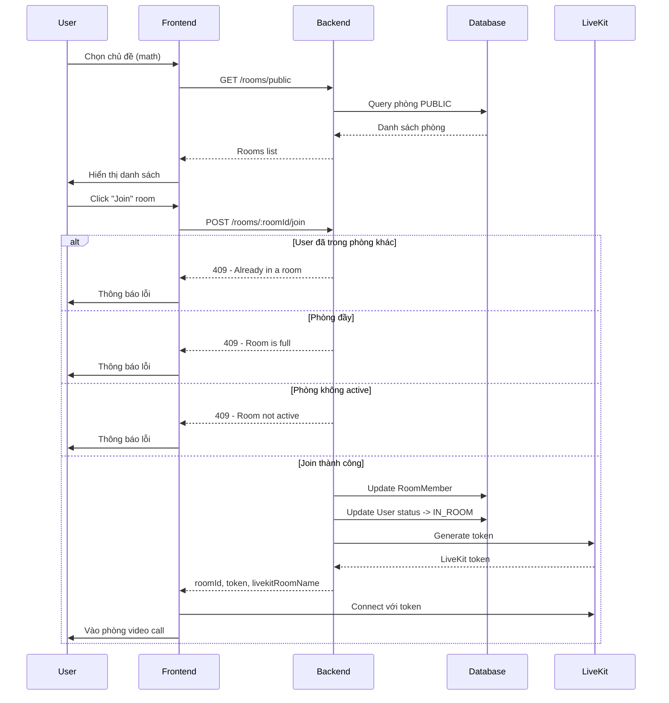
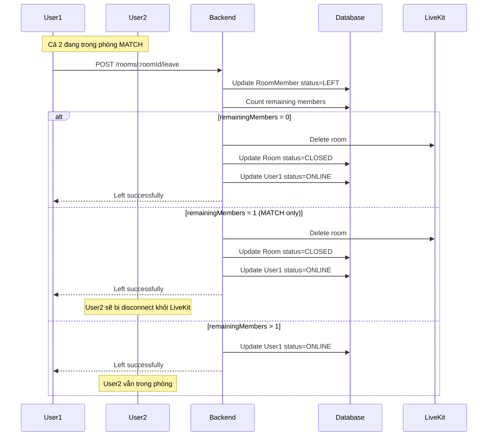
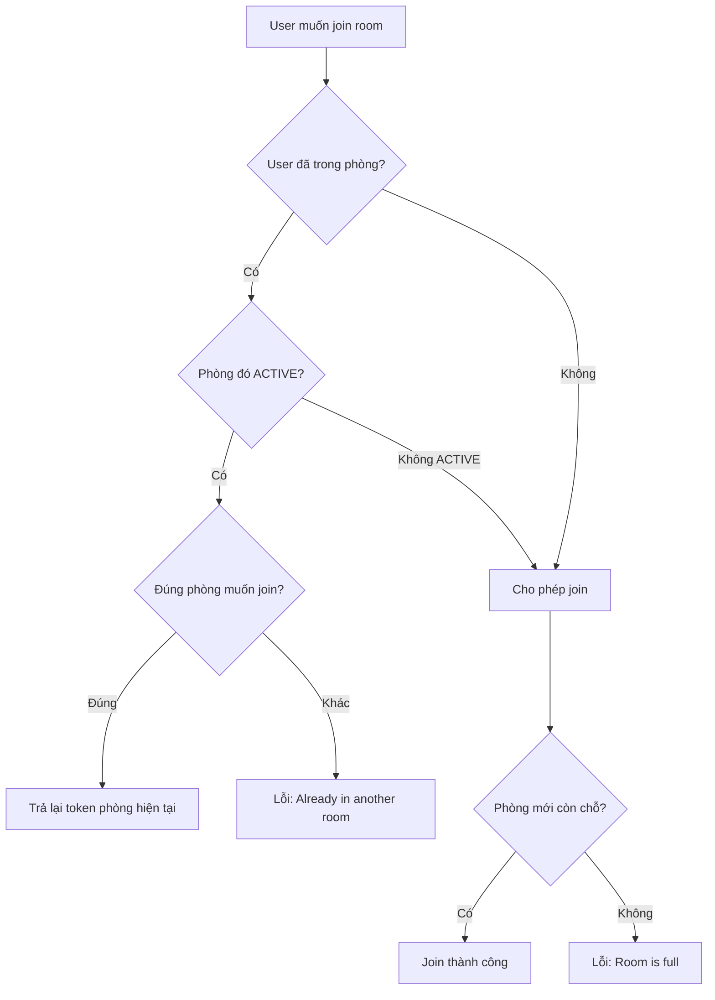

# Rooms Module - Hướng Dẫn Frontend Implementation

> **Phiên bản:** 1.0.0  
> **Ngày cập nhật:** 20/01/2026  
> **Module:** Rooms  
> **Backend Framework:** NestJS + Prisma + LiveKit

---

## 📋 Mục Lục

1. [Tổng Quan Module](#tổng-quan-module)
2. [Database Schema](#database-schema)
3. [API Endpoints](#api-endpoints)
4. [Luồng Nghiệp Vụ](#luồng-nghiệp-vụ)
5. [Integration Guide](#integration-guide)
6. [Examples & Code Samples](#examples--code-samples)
7. [Error Handling](#error-handling)
8. [Best Practices](#best-practices)

---

## 🎯 Tổng Quan Module

Module **Rooms** quản lý các phòng video call với LiveKit, bao gồm:

### Loại Phòng (RoomType)

- **PUBLIC**: Phòng công khai theo chủ đề (math, coding, etc.)
- **MATCH**: Phòng matchmaking 1-1 hoặc nhóm nhỏ

### Trạng Thái Phòng (RoomStatus)

- **WAITING**: Đang chờ thành viên (matchmaking)
- **ACTIVE**: Đang hoạt động
- **CLOSED**: Đã đóng

### Tính Năng Chính

- ✅ Liệt kê phòng công khai theo chủ đề
- ✅ Tham gia phòng công khai
- ✅ Tự động tìm/tạo phòng theo chủ đề
- ✅ Xem thông tin phòng
- ✅ Rời phòng
- ✅ Tích hợp LiveKit để video call
- ✅ Tự động đóng phòng MATCH khi còn ≤1 người

---

## 📊 Database Schema

### Model: Room

```prisma
model Room {
  id              String         @id @default(uuid())
  type            RoomType       @default(PUBLIC)      // MATCH | PUBLIC
  topic           String?                              // Chủ đề (math, coding, etc.)
  visibility      RoomVisibility @default(PUBLIC)      // PUBLIC | PRIVATE
  status          RoomStatus     @default(WAITING)     // WAITING | ACTIVE | CLOSED
  maxMembers      Int            @default(2)           // Số người tối đa
  livekitRoomName String?        @unique               // Tên phòng trên LiveKit
  startedAt       DateTime?                            // Thời gian bắt đầu
  endedAt         DateTime?                            // Thời gian kết thúc
  createdAt       DateTime       @default(now())
  updatedAt       DateTime       @updatedAt
  members         RoomMember[]                         // Danh sách thành viên
}
```

### Model: RoomMember

```prisma
model RoomMember {
  id       String           @id @default(uuid())
  roomId   String
  userId   String
  status   RoomMemberStatus @default(JOINED)  // JOINED | READY | LEFT
  joinedAt DateTime         @default(now())
  leftAt   DateTime?
  readyAt  DateTime?
  room     Room             @relation(fields: [roomId], references: [id])
  user     User             @relation(fields: [userId], references: [id])
}
```

### Enums

```typescript
enum RoomType {
  MATCH   // Phòng matchmaking (private)
  PUBLIC  // Phòng công khai theo chủ đề
}

enum RoomVisibility {
  PUBLIC   // Ai cũng thấy
  PRIVATE  // Chỉ thành viên thấy
}

enum RoomStatus {
  WAITING  // Đang chờ người
  ACTIVE   // Đang hoạt động
  CLOSED   // Đã đóng
}

enum RoomMemberStatus {
  JOINED  // Đã tham gia
  READY   // Đã sẵn sàng
  LEFT    // Đã rời
}
```

---

## 🔌 API Endpoints

### Base URL

```
/api/rooms
```

### Authentication

Tất cả endpoints **YÊU CẦU** JWT token trong header:

```
Authorization: Bearer <your_jwt_token>
```

---

### 1. **GET /rooms/public**

Lấy danh sách tất cả phòng công khai.

#### Request

```http
GET /api/rooms/public
Authorization: Bearer <token>
```

#### Response Success (200)

```json
{
  "error": false,
  "code": 0,
  "message": "Success",
  "data": {
    "rooms": [
      {
        "id": "room-uuid-1",
        "type": "PUBLIC",
        "topic": "math",
        "livekitRoomName": "public-math",
        "status": "ACTIVE",
        "maxMembers": 10,
        "currentMembers": 3
      },
      {
        "id": "room-uuid-2",
        "type": "PUBLIC",
        "topic": "coding",
        "livekitRoomName": "public-coding",
        "status": "ACTIVE",
        "maxMembers": 10,
        "currentMembers": 1
      }
    ]
  },
  "traceId": "abc123"
}
```

#### Response Error (401)

```json
{
  "error": true,
  "code": 401,
  "message": "Unauthorized",
  "data": null,
  "traceId": "err123"
}
```

---

### 2. **POST /rooms/:roomId/join**

Tham gia phòng công khai.

#### Request

```http
POST /api/rooms/550e8400-e29b-41d4-a716-446655440000/join
Authorization: Bearer <token>
```

#### Response Success (200)

```json
{
  "error": false,
  "code": 0,
  "message": "Joined room successfully",
  "data": {
    "roomId": "550e8400-e29b-41d4-a716-446655440000",
    "livekitRoomName": "public-math",
    "token": "eyJhbGciOiJIUzI1NiIsInR5cCI6IkpXVCJ9...",
    "topic": "math"
  },
  "traceId": "join123"
}
```

#### Response Errors

**404 - Room Not Found**

```json
{
  "error": true,
  "code": 404,
  "message": "Room not found",
  "data": null,
  "traceId": "err404"
}
```

**409 - Already in Room**

```json
{
  "error": true,
  "code": 409,
  "message": "User already in a room",
  "data": null,
  "traceId": "err409"
}
```

**409 - Room Full**

```json
{
  "error": true,
  "code": 409,
  "message": "Room is full",
  "data": null,
  "traceId": "err409"
}
```

**403 - Cannot Join Private Room**

```json
{
  "error": true,
  "code": 403,
  "message": "Can only join public rooms through this endpoint",
  "data": null,
  "traceId": "err403"
}
```

---

### 3. **GET /rooms/:roomId**

Lấy thông tin chi tiết phòng (chỉ thành viên mới xem được).

#### Request

```http
GET /api/rooms/550e8400-e29b-41d4-a716-446655440000
Authorization: Bearer <token>
```

#### Response Success (200)

```json
{
  "error": false,
  "code": 0,
  "message": "Success",
  "data": {
    "id": "550e8400-e29b-41d4-a716-446655440000",
    "type": "PUBLIC",
    "status": "ACTIVE",
    "maxMembers": 10,
    "members": [
      {
        "userId": "user-1",
        "status": "JOINED",
        "user": {
          "id": "user-1",
          "email": "user1@example.com",
          "firstName": "John",
          "lastName": "Doe",
          "avatar": "https://example.com/avatar1.jpg"
        }
      },
      {
        "userId": "user-2",
        "status": "JOINED",
        "user": {
          "id": "user-2",
          "email": "user2@example.com",
          "firstName": "Jane",
          "lastName": "Smith",
          "avatar": "https://example.com/avatar2.jpg"
        }
      }
    ]
  },
  "traceId": "xyz789"
}
```

#### Response Errors

**404 - Room Not Found**

```json
{
  "error": true,
  "code": 404,
  "message": "Room not found",
  "data": null,
  "traceId": "err404"
}
```

**403 - Not a Member**

```json
{
  "error": true,
  "code": 403,
  "message": "You are not a member of this room",
  "data": null,
  "traceId": "err403"
}
```

---

### 4. **POST /rooms/:roomId/leave**

Rời phòng.

#### Request

```http
POST /api/rooms/550e8400-e29b-41d4-a716-446655440000/leave
Authorization: Bearer <token>
```

#### Response Success (200)

```json
{
  "error": false,
  "code": 0,
  "message": "Left room successfully",
  "data": {
    "message": "Left room successfully"
  },
  "traceId": "leave123"
}
```

#### Response Errors

**404 - Room Not Found**

```json
{
  "error": true,
  "code": 404,
  "message": "Room not found",
  "data": null,
  "traceId": "err404"
}
```

---

## 🔄 Luồng Nghiệp Vụ

### 1. Luồng Tham Gia Phòng Công Khai



#### Step-by-step:

1. **Lấy danh sách phòng**

   ```javascript
   const response = await fetch('/api/rooms/public', {
     headers: {
       Authorization: `Bearer ${token}`,
     },
   });
   const { data } = await response.json();
   // data.rooms: array of rooms
   ```

2. **Hiển thị danh sách phòng**
   - Hiển thị topic, số người hiện tại/tối đa
   - Disable button "Join" nếu phòng đầy

3. **Tham gia phòng**

   ```javascript
   const response = await fetch(`/api/rooms/${roomId}/join`, {
     method: 'POST',
     headers: {
       Authorization: `Bearer ${token}`,
     },
   });
   const { data } = await response.json();
   // data: { roomId, livekitRoomName, token, topic }
   ```

4. **Kết nối LiveKit**

   ```javascript
   import { Room } from 'livekit-client';

   const room = new Room();
   await room.connect(LIVEKIT_URL, data.token);
   // Bắt đầu video call
   ```

5. **Rời phòng khi xong**

   ```javascript
   // Disconnect LiveKit
   room.disconnect();

   // Gọi API leave
   await fetch(`/api/rooms/${roomId}/leave`, {
     method: 'POST',
     headers: {
       Authorization: `Bearer ${token}`,
     },
   });
   ```

---

### 2. Luồng Tự Động Đóng Phòng MATCH



#### Quy Tắc Đóng Phòng:

**Phòng MATCH:**

- Đóng khi không còn ai (`remainingMembers = 0`)
- Đóng khi chỉ còn 1 người (`remainingMembers = 1`)
- Lý do: Phòng MATCH cần ít nhất 2 người để có ý nghĩa

**Phòng PUBLIC:**

- Không tự động đóng
- Vẫn mở ngay cả khi không còn ai
- Người khác vẫn có thể join

---

### 3. Luồng Kiểm Tra Trạng Thái User



---

## 💻 Integration Guide

### Prerequisites

**Frontend Dependencies:**

```bash
npm install livekit-client
# hoặc
yarn add livekit-client
```

**Environment Variables:**

```env
VITE_API_URL=http://localhost:3000/api
VITE_LIVEKIT_URL=wss://your-livekit-server.com
```

---

### React Example

#### 1. Service Layer

```typescript
// services/roomService.ts
import axios from 'axios';

const API_URL = import.meta.env.VITE_API_URL;

export interface PublicRoom {
  id: string;
  type: 'PUBLIC' | 'MATCH';
  topic: string;
  livekitRoomName: string;
  status: 'WAITING' | 'ACTIVE' | 'CLOSED';
  maxMembers: number;
  currentMembers: number;
}

export interface JoinRoomResponse {
  roomId: string;
  livekitRoomName: string;
  token: string;
  topic: string;
}

export interface RoomMember {
  userId: string;
  status: 'JOINED' | 'READY' | 'LEFT';
  user: {
    id: string;
    email: string;
    firstName: string;
    lastName: string;
    avatar: string | null;
  };
}

export interface RoomDetail {
  id: string;
  type: 'PUBLIC' | 'MATCH';
  status: 'WAITING' | 'ACTIVE' | 'CLOSED';
  maxMembers: number;
  members: RoomMember[];
}

class RoomService {
  private getAuthHeader() {
    const token = localStorage.getItem('access_token');
    return {
      headers: {
        Authorization: `Bearer ${token}`,
      },
    };
  }

  async getPublicRooms(): Promise<PublicRoom[]> {
    const response = await axios.get(`${API_URL}/rooms/public`, this.getAuthHeader());
    return response.data.data.rooms;
  }

  async joinRoom(roomId: string): Promise<JoinRoomResponse> {
    const response = await axios.post(`${API_URL}/rooms/${roomId}/join`, {}, this.getAuthHeader());
    return response.data.data;
  }

  async getRoomDetail(roomId: string): Promise<RoomDetail> {
    const response = await axios.get(`${API_URL}/rooms/${roomId}`, this.getAuthHeader());
    return response.data.data;
  }

  async leaveRoom(roomId: string): Promise<void> {
    await axios.post(`${API_URL}/rooms/${roomId}/leave`, {}, this.getAuthHeader());
  }
}

export default new RoomService();
```

---

#### 2. Rooms List Component

```typescript
// components/RoomsList.tsx
import React, { useState, useEffect } from 'react';
import roomService, { PublicRoom } from '@/services/roomService';

interface RoomsListProps {
  onJoinRoom: (roomId: string) => void;
}

export const RoomsList: React.FC<RoomsListProps> = ({ onJoinRoom }) => {
  const [rooms, setRooms] = useState<PublicRoom[]>([]);
  const [loading, setLoading] = useState(true);
  const [error, setError] = useState<string | null>(null);

  useEffect(() => {
    loadRooms();
  }, []);

  const loadRooms = async () => {
    try {
      setLoading(true);
      setError(null);
      const data = await roomService.getPublicRooms();
      setRooms(data);
    } catch (err: any) {
      setError(err.response?.data?.message || 'Failed to load rooms');
    } finally {
      setLoading(false);
    }
  };

  if (loading) return <div>Loading rooms...</div>;
  if (error) return <div className="error">{error}</div>;

  return (
    <div className="rooms-list">
      <h2>Public Rooms</h2>
      <button onClick={loadRooms}>Refresh</button>

      {rooms.length === 0 ? (
        <p>No public rooms available</p>
      ) : (
        <div className="rooms-grid">
          {rooms.map((room) => (
            <div key={room.id} className="room-card">
              <h3>{room.topic}</h3>
              <p>
                Members: {room.currentMembers}/{room.maxMembers}
              </p>
              <p>Status: {room.status}</p>
              <button
                onClick={() => onJoinRoom(room.id)}
                disabled={
                  room.currentMembers >= room.maxMembers ||
                  room.status !== 'ACTIVE'
                }
              >
                {room.currentMembers >= room.maxMembers
                  ? 'Full'
                  : 'Join Room'}
              </button>
            </div>
          ))}
        </div>
      )}
    </div>
  );
};
```

---

#### 3. Video Room Component (LiveKit Integration)

```typescript
// components/VideoRoom.tsx
import React, { useEffect, useRef, useState } from 'react';
import { Room, RoomEvent, Track } from 'livekit-client';
import roomService from '@/services/roomService';

interface VideoRoomProps {
  roomId: string;
  livekitUrl: string;
  token: string;
  onLeave: () => void;
}

export const VideoRoom: React.FC<VideoRoomProps> = ({
  roomId,
  livekitUrl,
  token,
  onLeave,
}) => {
  const [room] = useState(() => new Room());
  const [connected, setConnected] = useState(false);
  const [error, setError] = useState<string | null>(null);
  const videoContainerRef = useRef<HTMLDivElement>(null);

  useEffect(() => {
    connectToRoom();

    return () => {
      handleLeave();
    };
  }, []);

  const connectToRoom = async () => {
    try {
      await room.connect(livekitUrl, token);
      setConnected(true);

      // Enable camera and microphone
      await room.localParticipant.setCameraEnabled(true);
      await room.localParticipant.setMicrophoneEnabled(true);

      // Handle room events
      room.on(RoomEvent.TrackSubscribed, handleTrackSubscribed);
      room.on(RoomEvent.TrackUnsubscribed, handleTrackUnsubscribed);
      room.on(RoomEvent.Disconnected, handleDisconnected);

      // Render local video
      renderLocalVideo();
    } catch (err: any) {
      console.error('Failed to connect to room:', err);
      setError(err.message);
    }
  };

  const renderLocalVideo = () => {
    const localVideoTrack = room.localParticipant.videoTrackPublications.values().next().value?.track;

    if (localVideoTrack && videoContainerRef.current) {
      const element = localVideoTrack.attach();
      element.style.width = '100%';
      videoContainerRef.current.appendChild(element);
    }
  };

  const handleTrackSubscribed = (
    track: any,
    publication: any,
    participant: any
  ) => {
    if (track.kind === Track.Kind.Video || track.kind === Track.Kind.Audio) {
      const element = track.attach();

      if (track.kind === Track.Kind.Video) {
        element.style.width = '100%';
      }

      videoContainerRef.current?.appendChild(element);
    }
  };

  const handleTrackUnsubscribed = (track: any) => {
    track.detach().forEach((element: HTMLElement) => element.remove());
  };

  const handleDisconnected = () => {
    setConnected(false);
  };

  const handleLeave = async () => {
    try {
      // Disconnect from LiveKit
      room.disconnect();

      // Call API to leave room
      await roomService.leaveRoom(roomId);

      // Callback to parent
      onLeave();
    } catch (err: any) {
      console.error('Failed to leave room:', err);
      setError(err.message);
    }
  };

  const toggleCamera = async () => {
    const enabled = room.localParticipant.isCameraEnabled;
    await room.localParticipant.setCameraEnabled(!enabled);
  };

  const toggleMicrophone = async () => {
    const enabled = room.localParticipant.isMicrophoneEnabled;
    await room.localParticipant.setMicrophoneEnabled(!enabled);
  };

  if (error) {
    return (
      <div className="error">
        <p>Error: {error}</p>
        <button onClick={onLeave}>Back to Rooms</button>
      </div>
    );
  }

  return (
    <div className="video-room">
      <div className="video-container" ref={videoContainerRef} />

      <div className="controls">
        <button onClick={toggleCamera}>
          {room.localParticipant.isCameraEnabled ? '📹 Camera On' : '📹 Camera Off'}
        </button>
        <button onClick={toggleMicrophone}>
          {room.localParticipant.isMicrophoneEnabled ? '🎤 Mic On' : '🎤 Mic Off'}
        </button>
        <button onClick={handleLeave} className="leave-btn">
          Leave Room
        </button>
      </div>

      <div className="status">
        {connected ? '🟢 Connected' : '🔴 Disconnected'}
      </div>
    </div>
  );
};
```

---

#### 4. Main Component

```typescript
// components/RoomsPage.tsx
import React, { useState } from 'react';
import { RoomsList } from './RoomsList';
import { VideoRoom } from './VideoRoom';
import roomService, { JoinRoomResponse } from '@/services/roomService';

const LIVEKIT_URL = import.meta.env.VITE_LIVEKIT_URL;

export const RoomsPage: React.FC = () => {
  const [currentRoom, setCurrentRoom] = useState<JoinRoomResponse | null>(null);
  const [loading, setLoading] = useState(false);
  const [error, setError] = useState<string | null>(null);

  const handleJoinRoom = async (roomId: string) => {
    try {
      setLoading(true);
      setError(null);

      const roomData = await roomService.joinRoom(roomId);
      setCurrentRoom(roomData);
    } catch (err: any) {
      const errorMessage = err.response?.data?.message || 'Failed to join room';
      setError(errorMessage);

      // Show error toast
      alert(errorMessage);
    } finally {
      setLoading(false);
    }
  };

  const handleLeaveRoom = () => {
    setCurrentRoom(null);
    setError(null);
  };

  if (loading) {
    return (
      <div className="loading-container">
        <div className="spinner" />
        <p>Joining room...</p>
      </div>
    );
  }

  if (currentRoom) {
    return (
      <VideoRoom
        roomId={currentRoom.roomId}
        livekitUrl={LIVEKIT_URL}
        token={currentRoom.token}
        onLeave={handleLeaveRoom}
      />
    );
  }

  return (
    <div className="rooms-page">
      <h1>Study Rooms</h1>
      {error && <div className="error-banner">{error}</div>}
      <RoomsList onJoinRoom={handleJoinRoom} />
    </div>
  );
};
```

---

### Vue 3 Example

```vue
<!-- components/RoomsPage.vue -->
<template>
  <div class="rooms-page">
    <div v-if="loading" class="loading">
      <div class="spinner" />
      <p>Loading...</p>
    </div>

    <div v-else-if="error" class="error">
      {{ error }}
      <button @click="error = null">Dismiss</button>
    </div>

    <VideoRoom
      v-else-if="currentRoom"
      :room-id="currentRoom.roomId"
      :livekit-url="livekitUrl"
      :token="currentRoom.token"
      @leave="handleLeaveRoom"
    />

    <div v-else>
      <h1>Study Rooms</h1>
      <RoomsList @join="handleJoinRoom" />
    </div>
  </div>
</template>

<script setup lang="ts">
import { ref } from 'vue';
import RoomsList from './RoomsList.vue';
import VideoRoom from './VideoRoom.vue';
import roomService, { JoinRoomResponse } from '@/services/roomService';

const livekitUrl = import.meta.env.VITE_LIVEKIT_URL;

const currentRoom = ref<JoinRoomResponse | null>(null);
const loading = ref(false);
const error = ref<string | null>(null);

const handleJoinRoom = async (roomId: string) => {
  try {
    loading.value = true;
    error.value = null;

    const roomData = await roomService.joinRoom(roomId);
    currentRoom.value = roomData;
  } catch (err: any) {
    error.value = err.response?.data?.message || 'Failed to join room';
  } finally {
    loading.value = false;
  }
};

const handleLeaveRoom = () => {
  currentRoom.value = null;
  error.value = null;
};
</script>

<style scoped>
.rooms-page {
  padding: 20px;
}

.loading,
.error {
  text-align: center;
  padding: 40px;
}

.spinner {
  border: 4px solid #f3f3f3;
  border-top: 4px solid #3498db;
  border-radius: 50%;
  width: 40px;
  height: 40px;
  animation: spin 1s linear infinite;
  margin: 0 auto 20px;
}

@keyframes spin {
  0% {
    transform: rotate(0deg);
  }
  100% {
    transform: rotate(360deg);
  }
}

.error {
  background-color: #fee;
  color: #c33;
  padding: 15px;
  border-radius: 4px;
  margin-bottom: 20px;
}
</style>
```

---

## 🚨 Error Handling

### Common Errors

| Status Code | Error Message                                    | Giải Thích                                | Frontend Action                       |
| ----------- | ------------------------------------------------ | ----------------------------------------- | ------------------------------------- |
| **401**     | Unauthorized                                     | Token không hợp lệ hoặc hết hạn           | Redirect to login                     |
| **403**     | You are not a member of this room                | User không phải thành viên                | Show error, back to rooms list        |
| **403**     | Can only join public rooms through this endpoint | Cố join phòng PRIVATE qua endpoint PUBLIC | Show error                            |
| **404**     | Room not found                                   | Phòng không tồn tại hoặc đã xóa           | Show error, refresh list              |
| **409**     | User already in a room                           | User đã ở phòng khác                      | Hỏi user có muốn leave phòng cũ không |
| **409**     | Room is full                                     | Phòng đã đầy                              | Disable join button, show message     |
| **409**     | Room is not active                               | Phòng chưa ACTIVE                         | Disable join button                   |

### Error Handling Best Practices

```typescript
// services/errorHandler.ts
export class RoomError extends Error {
  constructor(
    public code: number,
    public message: string,
    public originalError?: any,
  ) {
    super(message);
  }
}

export const handleRoomError = (error: any): RoomError => {
  if (error.response) {
    const { status, data } = error.response;
    return new RoomError(status, data.message || 'An error occurred', error);
  }

  return new RoomError(500, 'Network error', error);
};

// Usage
try {
  await roomService.joinRoom(roomId);
} catch (err) {
  const roomError = handleRoomError(err);

  switch (roomError.code) {
    case 401:
      // Redirect to login
      router.push('/login');
      break;

    case 409:
      if (roomError.message.includes('already in a room')) {
        // Show confirmation dialog
        const shouldLeave = await confirm('You are already in a room. Leave current room?');
        if (shouldLeave) {
          await roomService.leaveRoom(currentRoomId);
          await roomService.joinRoom(roomId);
        }
      } else if (roomError.message.includes('full')) {
        alert('Room is full. Please try another room.');
      }
      break;

    case 404:
      alert('Room not found. It may have been deleted.');
      // Refresh rooms list
      loadRooms();
      break;

    default:
      alert(roomError.message);
  }
}
```

---

## ✅ Best Practices

### 1. **Connection Management**

```typescript
// ✅ GOOD: Proper cleanup
useEffect(() => {
  const room = new Room();

  const connect = async () => {
    await room.connect(url, token);
  };

  connect();

  return () => {
    room.disconnect(); // Always cleanup
  };
}, [url, token]);

// ❌ BAD: No cleanup
useEffect(() => {
  const room = new Room();
  room.connect(url, token);
  // Memory leak!
}, []);
```

### 2. **Error Recovery**

```typescript
// ✅ GOOD: Retry logic
const connectWithRetry = async (maxRetries = 3) => {
  for (let i = 0; i < maxRetries; i++) {
    try {
      await room.connect(url, token);
      return;
    } catch (err) {
      if (i === maxRetries - 1) throw err;
      await new Promise((resolve) => setTimeout(resolve, 1000 * (i + 1)));
    }
  }
};
```

### 3. **User Status Tracking**

```typescript
// Keep track of user's current room
interface UserRoomState {
  inRoom: boolean;
  currentRoomId: string | null;
  roomType: 'PUBLIC' | 'MATCH' | null;
}

const [roomState, setRoomState] = useState<UserRoomState>({
  inRoom: false,
  currentRoomId: null,
  roomType: null,
});

// Update when joining
const handleJoinRoom = async (roomId: string) => {
  const roomData = await roomService.joinRoom(roomId);
  setRoomState({
    inRoom: true,
    currentRoomId: roomData.roomId,
    roomType: 'PUBLIC',
  });
};

// Update when leaving
const handleLeaveRoom = async () => {
  await roomService.leaveRoom(roomState.currentRoomId!);
  setRoomState({
    inRoom: false,
    currentRoomId: null,
    roomType: null,
  });
};
```

### 4. **Prevent Multiple Room Joins**

```typescript
// ✅ GOOD: Check before joining
const handleJoinRoom = async (roomId: string) => {
  if (roomState.inRoom) {
    const shouldLeave = window.confirm(
      'You are already in a room. Leave current room to join this one?',
    );

    if (!shouldLeave) return;

    await roomService.leaveRoom(roomState.currentRoomId!);
  }

  const roomData = await roomService.joinRoom(roomId);
  // ...
};
```

### 5. **Handle Network Issues**

```typescript
// Listen for connection state changes
room.on(RoomEvent.ConnectionStateChanged, (state) => {
  switch (state) {
    case ConnectionState.Connected:
      console.log('Connected to room');
      break;
    case ConnectionState.Reconnecting:
      console.log('Reconnecting...');
      showToast('Connection lost. Reconnecting...');
      break;
    case ConnectionState.Disconnected:
      console.log('Disconnected from room');
      showToast('Disconnected from room');
      handleLeaveRoom();
      break;
  }
});
```

### 6. **Token Refresh**

```typescript
// LiveKit tokens có expiration time
// Nếu session dài, cần refresh token

const refreshToken = async () => {
  try {
    const response = await roomService.joinRoom(currentRoomId);
    return response.token;
  } catch (err) {
    console.error('Failed to refresh token:', err);
    throw err;
  }
};

// Check token expiration và refresh nếu cần
const checkTokenExpiration = () => {
  const tokenData = parseJwt(token);
  const expiresAt = tokenData.exp * 1000; // Convert to ms
  const now = Date.now();

  if (expiresAt - now < 5 * 60 * 1000) {
    // 5 minutes before expiry
    refreshToken();
  }
};
```

### 7. **Graceful Degradation**

```typescript
// Handle browser không support WebRTC
const checkWebRTCSupport = () => {
  if (!navigator.mediaDevices || !navigator.mediaDevices.getUserMedia) {
    alert('Your browser does not support video calls. Please use a modern browser.');
    return false;
  }
  return true;
};

// Request permissions trước
const requestMediaPermissions = async () => {
  try {
    const stream = await navigator.mediaDevices.getUserMedia({
      video: true,
      audio: true,
    });
    stream.getTracks().forEach((track) => track.stop()); // Release immediately
    return true;
  } catch (err) {
    alert('Please allow camera and microphone access to join the room.');
    return false;
  }
};
```

### 8. **UI/UX Guidelines**

```typescript
// Show loading states
const [joining, setJoining] = useState(false);

const handleJoinRoom = async (roomId: string) => {
  setJoining(true);
  try {
    await roomService.joinRoom(roomId);
  } finally {
    setJoining(false);
  }
};

// Disable buttons during operations
<button
  onClick={() => handleJoinRoom(room.id)}
  disabled={joining || room.currentMembers >= room.maxMembers}
>
  {joining ? 'Joining...' : 'Join Room'}
</button>

// Show confirmation before leaving
const handleLeaveRoom = async () => {
  const confirmed = window.confirm('Are you sure you want to leave the room?');
  if (!confirmed) return;

  await roomService.leaveRoom(roomId);
};
```

---

## 🔔 WebSocket Events (Optional)

Nếu backend có WebSocket, Frontend có thể lắng nghe các events real-time:

### Events to Listen

```typescript
// Socket events
socket.on('room:member_joined', (data) => {
  // { roomId, userId, user }
  // Update members list
});

socket.on('room:member_left', (data) => {
  // { roomId, userId }
  // Update members list
});

socket.on('room:status_changed', (data) => {
  // { roomId, status }
  // Update room status
});

socket.on('room:closed', (data) => {
  // { roomId, reason }
  // Force leave if user in this room
  if (data.roomId === currentRoomId) {
    handleForceLeave('Room has been closed');
  }
});
```

---

## 📱 Mobile Considerations

### iOS

- Request microphone/camera permissions trong Info.plist
- WebRTC có thể không hoạt động trong WKWebView, cần Safari hoặc native implementation

### Android

- Request permissions trong AndroidManifest.xml
- WebRTC hoạt động tốt trong Chrome WebView

### React Native

```bash
npm install @livekit/react-native
```

---

## 🧪 Testing

### Unit Tests

```typescript
// services/roomService.test.ts
import { describe, it, expect, vi } from 'vitest';
import roomService from './roomService';
import axios from 'axios';

vi.mock('axios');

describe('RoomService', () => {
  it('should get public rooms', async () => {
    const mockRooms = [{ id: '1', topic: 'math', currentMembers: 3, maxMembers: 10 }];

    axios.get.mockResolvedValue({
      data: { data: { rooms: mockRooms } },
    });

    const rooms = await roomService.getPublicRooms();
    expect(rooms).toEqual(mockRooms);
  });

  it('should handle join room error', async () => {
    axios.post.mockRejectedValue({
      response: { status: 409, data: { message: 'Room is full' } },
    });

    await expect(roomService.joinRoom('room-1')).rejects.toThrow();
  });
});
```

### E2E Tests

```typescript
// tests/e2e/rooms.spec.ts
import { test, expect } from '@playwright/test';

test('should list and join public rooms', async ({ page }) => {
  // Login first
  await page.goto('/login');
  await page.fill('[name="email"]', 'test@example.com');
  await page.fill('[name="password"]', 'password123');
  await page.click('button[type="submit"]');

  // Navigate to rooms
  await page.goto('/rooms');

  // Wait for rooms to load
  await page.waitForSelector('.room-card');

  // Check if rooms are displayed
  const roomCards = await page.$$('.room-card');
  expect(roomCards.length).toBeGreaterThan(0);

  // Click join button on first room
  await page.click('.room-card:first-child button');

  // Wait for video room
  await page.waitForSelector('.video-room');

  // Check if video container exists
  const videoContainer = await page.$('.video-container');
  expect(videoContainer).toBeTruthy();
});
```

---

## 📚 Additional Resources

- [LiveKit Documentation](https://docs.livekit.io/)
- [LiveKit React Components](https://docs.livekit.io/client-sdk-js/classes/Room.html)
- [WebRTC API](https://developer.mozilla.org/en-US/docs/Web/API/WebRTC_API)
- [NestJS Documentation](https://docs.nestjs.com/)

---

## 🆘 Troubleshooting

### Problem: "User already in a room" error

**Solution:**

- Call `/rooms/:roomId/leave` API trước khi join phòng mới
- Implement confirmation dialog để user chọn

### Problem: LiveKit connection fails

**Solution:**

- Check LIVEKIT_URL đúng format: `wss://your-server.com`
- Verify token chưa expire
- Check network/firewall có block WebRTC không

### Problem: Video không hiển thị

**Solution:**

- Check camera permissions
- Verify `setCameraEnabled(true)` được gọi
- Check track attachment đúng cách

### Problem: Room closes unexpectedly

**Solution:**

- Check backend logs để xem lý do
- Phòng MATCH tự động đóng khi còn ≤1 người
- Implement reconnection logic

---

## 🔄 Changelog

### Version 1.0.0 (20/01/2026)

- ✅ Initial documentation
- ✅ All public room endpoints
- ✅ LiveKit integration guide
- ✅ React & Vue examples
- ✅ Error handling guide
- ✅ Best practices

---

## 📞 Support

Nếu có vấn đề, liên hệ Backend Team hoặc tạo issue trong repository.

**Happy Coding! 🚀**
